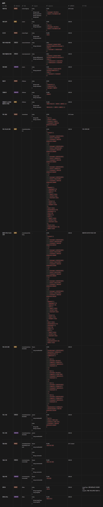
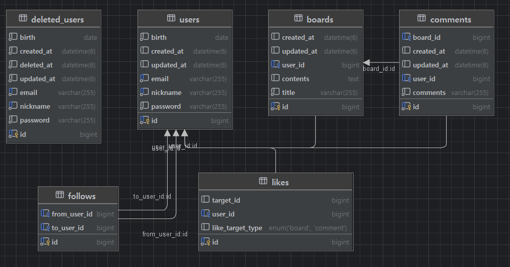

* toc
{:toc}

## 📖 Today I Learned
### NewsFeed Project README

<!-- <h4> 📃 </h4> -->

---


## 개요
- Srping Boot, Spring Data JPA와 MySQL을 사용한 뉴스 피드 제작

## 개발 환경
언어 :   

JDK :   

프레임워크 :   

DB :   

ORM :   

# API 명세서


# ERD


# 기능 요약
- 유저 CRUD
- 뉴스피드 CRUD
- 댓글 CRUD
- 팔로우 CRUD
- 좋아요 CRUD
- JWT 를 이용한 로그인

# 디렉토리 구조
```
/newsfeed
├── common
│       ├── config
│       │       └── PasswordEncoder
│       ├── exception
│       │       ├── CustomException
│       │       ├── ErrorCode
│       │       ├── ErrorResponse
│       │       ├── GlobalExceptionHandler
│       │       └── UserNotFoundException
│       ├── filter
│       │       └── JwtAuthFilter
│       └── jwt
│             ├── JwtProperties
│             └── JwtUtil
├── controller
│       ├── BoardController
│       ├── CommentController
│       ├── FollowController
│       ├── LikeController
│       └── UserController
├── dto
│     ├── board
│     │     ├── BoardDetailResponseDto
│     │     ├── BoardListDto
│     │     ├── BoardRequestDto
│     │     └── BoardResponseDto
│     ├── comment
│     │       ├── CommentRequestDto
│     │       └── CommentResponseDto
│     ├── follow
│     │       └── FollowResponseDto
│     ├── like
│     │     └── LikeRequestDto
│     └── user
│           ├── DeleteUserRequestDto
│           ├── LoginRequestDto
│           ├── LikeRequestDto
│           ├── SignUpResponseDto
│           ├── UpdateNicknameRequestDto
│           ├── UpdatePasswordRequestDto
│           ├── UserRequestDto
│           └── UserResponseDto
├── entity
│     ├── BaseEntity
│     ├── Board
│     ├── Comment
│     ├── DeletedUser
│     ├── Follow
│     ├── Like
│     ├── LikeType
│     └── User
├── repository
│       ├── BoardRepository
│       ├── CommentRepository
│       ├── DeletedUserRepository
│       ├── FollowRepository
│       ├── LikeRepository
│       └── UserRepository
├── service
│       ├── BoardService
│       ├── CommentService
│       ├── FollowService
│       ├── LikeService
│       └── UserService
└── NewsfeedApplication

```


<!-- --- -->

<!-- <h2> 💬 </h2> -->

<!-- <h4>  </h4> -->
